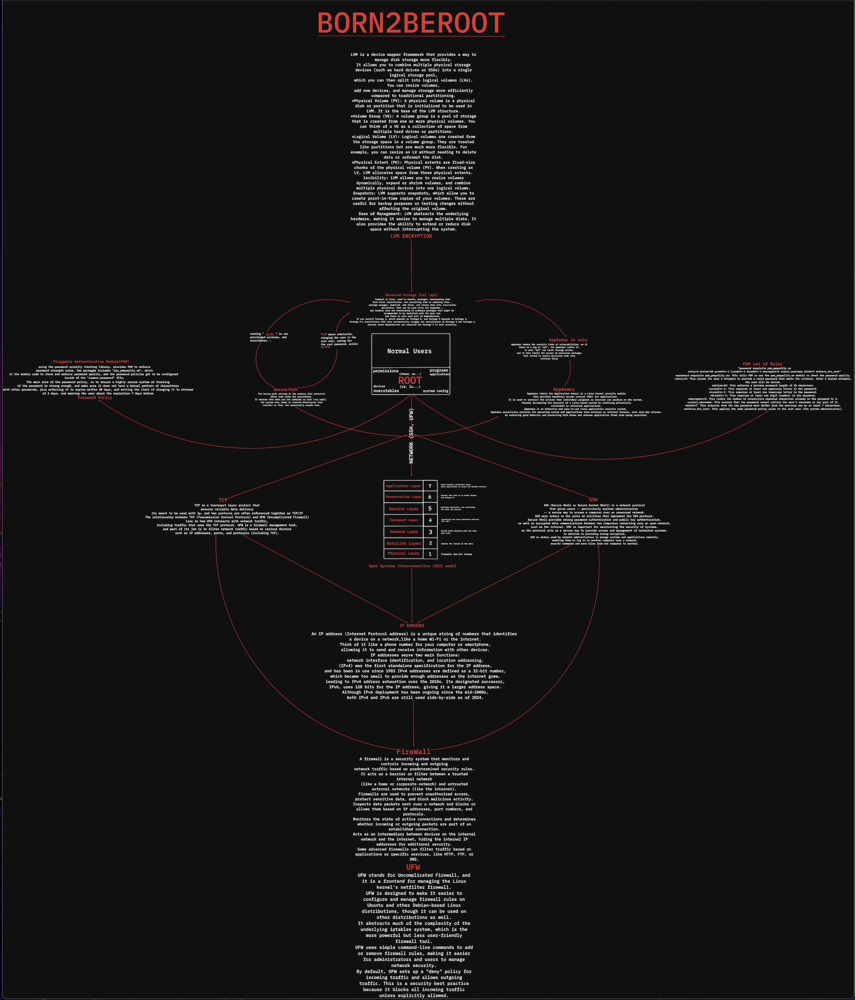
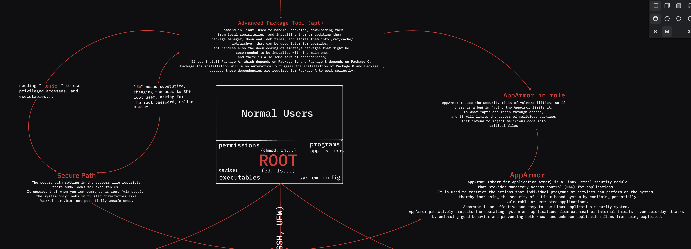

***Born2beroot_42***

This project goal, is to shade light upon many areas, where security must be provided.
diving into concepts like **Secure Path**, **Root Privileges**, **SUDO** and **SU**, **Network** also, as for **Firewalls**, **TCP/IP** connections, and **IP ADDRESSES**, tools, like **APPARMOR** and **APT**, and the differences between **RED HAT** and **UBUNTU**.

***Diagram:***

Closer look for some blurred parts, sorry for the quality.

